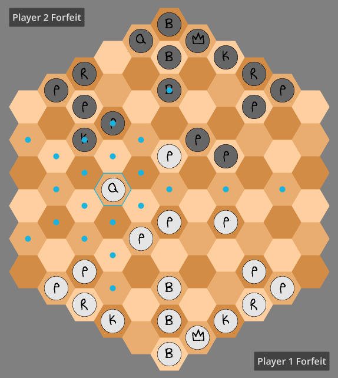

# HexChess

Based on [Gliński's hexagonal chess](https://en.wikipedia.org/wiki/Hexagonal_chess#Gli%C5%84ski's_hexagonal_chess) version.

Hex math help from [Hexagonal Grids - Red Blob Games](https://www.redblobgames.com/grids/hexagons/).

## Screenshot

Selected piece has its hex outlined, and dots show the legal locations it can move to.
